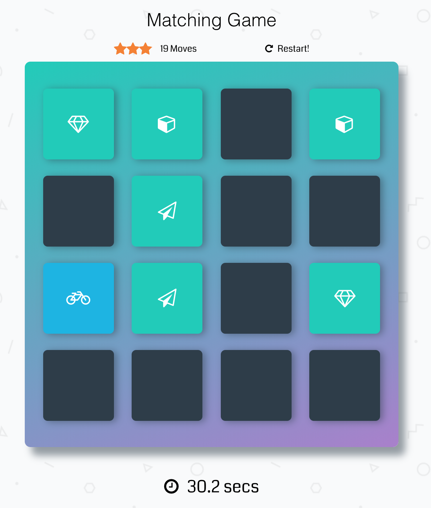

# Memory Game Challenge

## Context
This is the classical Memory Game Challenge. 

### How the Game Works
The game board consists of sixteen "cards" arranged in a grid. The deck is made up of eight different pairs of cards, each with different symbols on one side. The cards are arranged randomly on the grid with the symbol face down. The gameplay rules are very simple: flip over two hidden cards at a time to locate the ones that match!

**Each turn:**

- The player flips one card over to reveal its underlying symbol.
- The player then turns over a second card, trying to find the corresponding card with the same symbol.
- If the cards match, both cards stay flipped over.
- If the cards do not match, both cards are flipped face down.
- The game ends once all cards have been correctly matched.

### Game Functionality
The real-life game, players flip over cards to locate the pairs that match The goal is to recreate this effect in your project. There are a couple of interactions that you'll need to handle:

## Features
- Everything is documented with JsDocs 
- Everything follows the Js Guidelines
- No external libraries, except font awesome.
- Git-flow has been used.
- Semantic version has been used (semver).

### Dependencies
- Boostrap (v.4)
- Coda from Google Fonts 

### [Play Demo](https://kooltheba.github.io/memory-game/)

